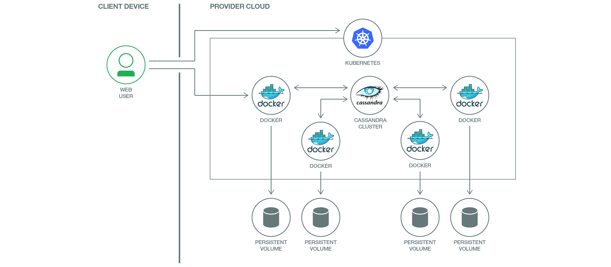

[](https://travis-ci.org/IBM/Scalable-Cassandra-deployment-on-Kubernetes)

# 쿠버네티스 클러스터에 확장형 멀티노드 카산드라 배포하기

*다른 언어로 보기: [English](README.md).*

이 개발 과정은 쿠버네티스(Kubernetes)에 확장형(scalable) 멀티노드 카산드라 클러스터를 배포하는 방법을 설명합니다. 아파치 카산드라는 확장성이 뛰어난 오픈소스 NoSQL 데이터베이스로서 여러 데이터센터 또는 클라우드 환경에서 대용량의 정형, 반정형, 비정형 데이터를 완벽하게 관리합니다.

이 과정에서는 쿠버네티스에 클라우드 네이티브 카산드라를 배포하는 방식을 알아봅니다. 클러스터 환경에서 카산드라를 구동하게 되는데, 클러스터 인프라의 특성을 활용하여 애플리케이션 구현을 지원합니다.

Bluemix 컨테이너 서비스 상의 쿠버네티스 클러스터를 이용하여 비영구적 또는 영구적 저장 매체 기반의 카산드라 클러스터를 구축하는 방법을 리플리케이션 컨트롤러(Replication Controller), 스테이트풀세트(StatefulSets) 등과 같은 쿠버네티스 개념을 활용하여 단계별로 설명하겠습니다.



## 사용된 쿠버네티스 개념들

- [쿠버네티스 Pod(Kubenetes Pod)](https://kubernetes.io/docs/user-guide/pods)
- [쿠버네티스 서비스(Kubenetes Services)](https://kubernetes.io/docs/user-guide/services) 
- [쿠버네티스 리플리케이션 컨트롤러(Kubernetes Replication Controller)](https://kubernetes.io/docs/user-guide/replication-controller/)
- [쿠버네티스 스테이트풀세트(Kubernets StatefulSets)](https://kubernetes.io/docs/concepts/workloads/controllers/statefulset/)

## 포함된 구성요소
- [쿠버네티스 클러스터(Kubernetes Clusters)](https://console.ng.bluemix.net/docs/containers/cs_ov.html#cs_ov)
- [Bluemix 컨테이너 서비스(Bluemix container service)](https://console.ng.bluemix.net/catalog/?taxonomyNavigation=apps&category=containers)
- [Bluemix DevOps 툴체인 서비스(Bluemix DevOps Toolchain Service)](https://console.ng.bluemix.net/catalog/services/continuous-delivery)
- [카산드라(Cassandra)](http://cassandra.apache.org/)

## 전제조건

쿠버네티스 클러스터를 생성합니다. 로컬 환경에서의 테스트는  [미니큐브(Minikube)](https://kubernetes.io/docs/getting-started-guides/minikube)를 활용하고,클라우드 환경에서는 [IBM Bluemix 컨테이너 서비스(Bluemix Container Service)](https://github.com/IBM/container-journey-template) 를 활용합니다.이 예제의 코드는 Travis를 사용하여 [Bluemix 컨테이너 서비스 상의 쿠버네티스 클러스터(Kubernetes Cluster from Bluemix Container Service)](https://console.ng.bluemix.net/docs/containers/cs_ov.html#cs_ov) 환경에서 정기적으로 테스트 됩니다.

## Bluemix에서 쿠버네티스 클러스터로 구현하기
카산드라 노드를 Bluemix 환경에 직접 구현하려면, 아래의 ‘Deploy to Bluemix’ 버튼을 클릭하여 샘플 구현을 위한 Bluemix DevOps 서비스 툴체인과 파이프라인을 생성하세요. 그렇지 않은 경우에는, [단계](#단계)로 이동하십시오.

> 우선, 여러분의 쿠버네티스 클러스터를 생성하고, Bluemix 계정 내 해당 구성이 완료되었는지의 여부를 확인하세요.

[툴체인 가이드](https://github.com/IBM/container-journey-template/blob/master/images/button.png)(https://console.ng.bluemix.net/devops/setup/deploy/)를 참고하여 툴체인과 파이프라인을 완성하십시오.

카산드라 클러스터는 쿠버네티스 클러스터의 public IP 상에 노출되지 않습니다. 하지만, `bx cs cluster-config <your-cluster-name>`을 이용하고  [5단계 CQL 사용하기](#5-cql-사용하기)를  진행하여 사용자의 쿠버네티스 클러스터 설정을 통해 접근할 수 있습니다. 또는, 간단하게 `kubectl exec <POD-NAME> -- nodetool status`로 상태를 확인할 수도 있습니다.  

## 단계

###카산드라 클러스터 형성 및 Pod간 DNS Lookup을 위한 쿠버네티스 서비스 생성하기

1. [카산드라 헤드리스 서비스 생성하기](#1-카산드라-헤드리스-서비스-생성하기)

### 리플리케이션 컨트롤러(Replication Controller) 이용으로 비영구적 저장 매체 기반의 카산드라 클러스터 생성하기

2. [리플리케이션 컨트롤러 생성하기](#2-리플리케이션-컨트롤러-생성하기)
3. [리플리케이션 컨트롤러 검증하기](#3-리플리케이션-컨트롤러-검증하기)
4. [리플리케이션 컨트롤러 확장하기](#4-리플리케이션-컨트롤러-확장하기)
5. [CQL(카산드라 쿼리 언어) 사용하기](#5-cql-사용하기)

### 스테이트풀세트(StatefulSets)를 사용하여 영구적 저장 매체 기반의 카산드라 클러스터 생성하기

6. [로컬 볼륨(Local Volumes) 생성하기](#6-로컬-볼륨-생성하기)
7. [스테이트풀세트(StatefulSet) 생성하기](#7-스테이트풀세트-생성하기)
8. [스테이트풀세트 검증하기](#8-스테이트풀세트-검증하기)
9. [스테이트풀세트 확장하기](#9-스테이트풀세트-확장하기)
10. [CQL(카산드라 쿼리 언어) 사용하기](#10-cql-사용하기)

#### [문제 해결](#문제-해결)


# 1. 카산드라 헤드리스 서비스 생성하기
이 샘플 앱에서는 로드 밸런싱과 단일(single) 서비스 IP를 사용하지 않습니다. 이 경우,  **clusterIP** 를 **none** 으로 지정하여 ‘헤드리스(headless)’ 서비스를 생성할 수 있습니다. 카산드라 시드(seed) 노드의 IP 주소를 알기 위해 헤드리스 서비스를 활용할 것입니다.
아래는 헤드리스 서비스에 관한 서비스 명세입니다

```yaml
apiVersion: v1
kind: Service
metadata:
  labels:
    app: cassandra
  name: cassandra
spec:
  clusterIP: None
  ports:
    - port: 9042
  selector:
    app: cassandra
```
제공된 yaml 파일을 이용하여 헤드리스 서비스를 생성할 수 있습니다:
```bash
$ kubectl create -f cassandra-service.yaml
service "cassandra" created
```

스테이트풀세트를 이용하여 영구적 카산드라 클러스터를 생성하고자 하는 경우, [6단계 로컬 볼륨 생성하기](#6-로컬-볼륨-생성하기)로 이동하십시오.

# 2. 리플리케이션 컨트롤러 생성하기 
리플리케이션 컨트롤러는 Pod를 생성 또는 제거하여 Pod 개수가 ‘replicas’에 정의된 개수와 일치하도록 해줍니다. Pod의 템플릿은 리플리케이션 컨트롤러 관련 설정 섹션에서 정의됩니다. 각 Pod마다 사용되는 리소스 양을 템플릿 내에 설정하고, 사용 가능한 리소스를 제한할 수 있습니다. 아래는 리플리케이션 컨트롤러 관련 명세입니다.
```yaml
apiVersion: v1
kind: ReplicationController
metadata:
  name: cassandra
  # The labels will be applied automatically
  # from the labels in the pod template, if not set
  # labels:
    # app: cassandra
spec:
  replicas: 1
  # The selector will be applied automatically
  # from the labels in the pod template, if not set.
  # selector:
      # app: cassandra
  template:
    metadata:
      labels:
        app: cassandra
    spec:
      containers:
        - env:
            - name: CASSANDRA_SEED_DISCOVERY
              value: cassandra
            # CASSANDRA_SEED_DISCOVERY should match the name of the service in cassandra-service.yaml

            - name: CASSANDRA_CLUSTER_NAME
              value: Cassandra
            - name: CASSANDRA_DC
              value: DC1
            - name: CASSANDRA_RACK
              value: Rack1
            - name: CASSANDRA_ENDPOINT_SNITCH
              value: GossipingPropertyFileSnitch
          image: docker.io/anthonyamanse/cassandra-demo:7.0
          name: cassandra
          ports:
            - containerPort: 7000
              name: intra-node
            - containerPort: 7001
              name: tls-intra-node
            - containerPort: 7199
              name: jmx
            - containerPort: 9042
              name: cql
          volumeMounts:
            - mountPath: /var/lib/cassandra/data
              name: data
      volumes:
        - name: data
          emptyDir: {}
```
제공된 yaml 파일을 이용하여 replica 하나에 대한 생성을 리플리케이션 컨트롤러를 통해 진행합니다.:
```bash
$ kubectl create -f cassandra-controller.yaml
replicationcontroller "cassandra" created
```

# 3. 리플리케이션 컨트롤러 검증하기
아래 명령을 사용하여 리플리케이션 컨트롤러 리스트를 확인합니다:
```bash
$ kubectl get rc
NAME        DESIRED   CURRENT   READY     AGE
cassandra   1         1         1         1m
```
Pod 리스트를 통해 반드시 한 개의 Pod가 실행 중인 것이 확인되어야 합니다. 아래 명령을 사용하여 리플리케이션 컨트롤러가 생성한 Pod를 확인하십시오:

```bash
$ kubectl get pods -o wide
NAME              READY     STATUS    RESTARTS   AGE       IP              NODE
cassandra-xxxxx   1/1       Running   0          1m        172.xxx.xxx.xxx   169.xxx.xxx.xxx
```

카산드라 노드의 작동 여부를 확인하려면 **nodetool status:** 를 실행하십시오:
> Pod가 컨테이너를 생성하지 않았거나 카산드라 인스턴스가 설치를 완료하지 않은 경우, 아래 명령이 실행되지 않을 수 있습니다.

```bash
$ kubectl exec -ti cassandra-xxxxx -- nodetool status
Datacenter: DC1
===============
Status=Up/Down
|/ State=Normal/Leaving/Joining/Moving
--  Address          Load       Tokens       Owns (effective)   Host ID                               Rack
UN  172.xxx.xxx.xxx  109.28 KB  256          100.0%             6402e90d-7995-4ee1-bb9c-36097eb2c9ec  Rack1
```

Pod 개수를 늘리기 위해, 리플리케이션 컨트롤러를 가용 리소스가 수용할 수 있는 만큼 확장할 수 있습니다. 다음 단계로 이동하십시오.

# 4. 리플리케이션 컨트롤러 확장하기

아래의 명령을 이용하여 리플리케이션 컨트롤러를 확장(scale)할 수 있습니다.
```bash
$ kubectl scale rc cassandra --replicas=4
replicationcontroller "cassandra" scaled
```
확장한 이후에는 개수가 원하는만큼 증가했는지 확인하십시오.
```bash
$ kubectl get rc
NAME        DESIRED   CURRENT   READY     AGE
cassandra   4         4         4         3m
```
Pod 리스트를 재확인하여 Pod 작동 여부를 확인하십시오.
```bash
$ kubectl get pods -o wide
NAME              READY     STATUS    RESTARTS   AGE       IP                NODE
cassandra-1lt0j   1/1       Running   0          13m       172.xxx.xxx.xxx   169.xxx.xxx.xxx
cassandra-vsqx4   1/1       Running   0          38m       172.xxx.xxx.xxx   169.xxx.xxx.xxx
cassandra-jjx52   1/1       Running   0          38m       172.xxx.xxx.xxx   169.xxx.xxx.xxx
cassandra-wzlxl   1/1       Running   0          38m       172.xxx.xxx.xxx   169.xxx.xxx.xxx
```
아래의 서비스 엔드포인트 쿼리를 사용하여 Pod가 서비스에서 확인 가능한지의 여부를 점검하십시오:

```bash
$ kubectl get endpoints cassandra -o yaml
apiVersion: v1
kind: Endpoints
metadata:
  creationTimestamp: 2017-03-15T19:53:09Z
  labels:
    app: cassandra
  name: cassandra
  namespace: default
  resourceVersion: "10591"
  selfLink: /api/v1/namespaces/default/endpoints/cassandra
  uid: 03e992ca-09b9-11e7-b645-daaa1d04f9b2
subsets:
- addresses:
  - ip: 172.xxx.xxx.xxx
    nodeName: 169.xxx.xxx.xxx
    targetRef:
      kind: Pod
      name: cassandra-xp2jx
      namespace: default
      resourceVersion: "10583"
      uid: 4ee1d4e2-09b9-11e7-b645-daaa1d04f9b2
  - ip: 172.xxx.xxx.xxx
    nodeName: 169.xxx.xxx.xxx
    targetRef:
      kind: Pod
      name: cassandra-gs64p
      namespace: default
      resourceVersion: "10589"
      uid: 4ee2025b-09b9-11e7-b645-daaa1d04f9b2
  - ip: 172.xxx.xxx.xxx
      nodeName: 169.xxx.xxx.xxx
      targetRef:
        kind: Pod
        name: cassandra-g5wh8
        namespace: default
        resourceVersion: "109410"
        uid: a39ab3ce-0b5a-11e7-b26d-665c3f9e8d67
    - ip: 172.xxx.xxx.xxx
      nodeName: 169.xxx.xxx.xxx
      targetRef:
        kind: Pod
        name: cassandra-gf37p
        namespace: default
        resourceVersion: "109418"
        uid: a39abcb9-0b5a-11e7-b26d-665c3f9e8d67
    ports:
    - port: 9042
      protocol: TCP
```
nodetool status를 실행하면 다른 카산드라 노드가 추가되어 카산드라 클러스터를 형성했는지의 여부를 확인할 수 있습니다. Pod의 이름을 본인 환경의 Pod이름으로 변경하십시오:
You can perform a **nodetool status** to check if the other cassandra nodes have joined and formed a Cassandra cluster. **Substitute the Pod name to the one you have:**
```bash
$ kubectl exec -ti cassandra-xxxxx -- nodetool status
Datacenter: DC1
===============
Status=Up/Down
|/ State=Normal/Leaving/Joining/Moving
--  Address          Load       Tokens       Owns (effective)  Host ID                               Rack
UN  172.xxx.xxx.xxx  109.28 KB  256          50.0%             6402e90d-7995-4ee1-bb9c-36097eb2c9ec  Rack1
UN  172.xxx.xxx.xxx  196.04 KB  256          51.4%             62eb2a08-c621-4d9c-a7ee-ebcd3c859542  Rack1
UN  172.xxx.xxx.xxx  114.44 KB  256          46.2%             41e7d359-be9b-4ff1-b62f-1d04aa03a40c  Rack1
UN  172.xxx.xxx.xxx  79.83 KB   256          52.4%             fb1dd881-0eff-4883-88d0-91ee31ab5f57  Rack1
```


# 5. CQL 사용하기
> **참고:** 카산드라 데이터베이스가 설치를 완료하기까지 약 5분이 소요됩니다.

카산드라 노드의 상태는 아래의 명령을 이용하여 확인이 가능합니다.
**Pod의 이름을 본인 환경의 Pod 이름으로 변경하십시오.**
```bash
$ kubectl exec cassandra-xxxxx -- nodetool status
Datacenter: DC1
===============
Status=Up/Down
|/ State=Normal/Leaving/Joining/Moving
--  Address          Load       Tokens       Owns (effective)  Host ID                               Rack
UN  172.xxx.xxx.xxx  109.28 KB  256          50.0%             6402e90d-7995-4ee1-bb9c-36097eb2c9ec  Rack1
UN  172.xxx.xxx.xxx  196.04 KB  256          51.4%             62eb2a08-c621-4d9c-a7ee-ebcd3c859542  Rack1
UN  172.xxx.xxx.xxx  114.44 KB  256          46.2%             41e7d359-be9b-4ff1-b62f-1d04aa03a40c  Rack1
UN  172.xxx.xxx.xxx  79.83 KB   256          52.4%             fb1dd881-0eff-4883-88d0-91ee31ab5f57  Rack1
```
> 다음 단계에서 명령을 실행하려면 노드 상태가 완전히 실행될 때까지 기다려야 합니다.


아래 명령을 이용하여 카산드라 컨테이너에 접근합니다:

```bash
$ kubectl exec -it cassandra-xxxxx /bin/bash
root@cassandra-xxxxx:/# ls
bin  boot  dev	docker-entrypoint.sh  etc  home  initial-seed.cql  lib	lib64  media  mnt  opt	proc  root  run  sbin  srv  sys  tmp  usr  var
```

이제, 샘플 .cql 파일 실행을 통해 하기 명령을 이용하여 ‘employee’ 테이블을 생성 및 업데이트할 수 있습니다:
> **한개** 의 카산드라 노드에서는 cql 파일을  **한번** 만 실행하면 됩니다.다른 Pod들도 .cql 파일에 의해 생성된 샘플 테이블에 대해 접근이 가능할 것입니다.
```bash
root@cassandra-xxxxx:/# cqlsh -f initial-seed.cql
root@cassandra-xxxxx:/# cqlsh
Connected to Test Cluster at 127.0.0.1:9042.
[cqlsh 5.0.1 | Cassandra 3.10 | CQL spec 3.4.4 | Native protocol v4]
Use HELP for help.
cqlsh> DESCRIBE TABLES

Keyspace my_cassandra_keyspace
------------------------------
employee

Keyspace system_schema
----------------------
tables     triggers    views    keyspaces  dropped_columns
functions  aggregates  indexes  types      columns

Keyspace system_auth
--------------------
resource_role_permissons_index  role_permissions  role_members  roles

Keyspace system
---------------
available_ranges          peers               batchlog        transferred_ranges
batches                   compaction_history  size_estimates  hints
prepared_statements       sstable_activity    built_views
"IndexInfo"               peer_events         range_xfers
views_builds_in_progress  paxos               local

Keyspace system_distributed
---------------------------
repair_history  view_build_status  parent_repair_history

Keyspace system_traces
----------------------
events  sessions

cqlsh> SELECT * FROM my_cassandra_keyspace.employee;

 emp_id | emp_city | emp_name | emp_phone  | emp_sal
--------+----------+----------+------------+---------
      1 |       SF |    David | 9848022338 |   50000
      2 |      SJC |    Robin | 9848022339 |   40000
      3 |   Austin |      Bob | 9848022330 |   45000
```

드디어, 비영구적 저장 매체 기반의 카산드라 클러스터의 가동 준비가 완료되었습니다.

**영구적 저장 매체 기반의 카산드라 클러스터를 생성하려면, 단계를 계속 진행하십시오. 단, 진행에 앞서 카산드라 리플리케이션 컨트롤러를 제거해야 합니다.**

```bash
$ kubectl delete rc cassandra
```
# 6. 로컬 볼륨 생성하기

헤드리스 서비스를 아직 생성하지 않았다면, 우선  [카산드라 헤드리스 서비스 생성하기](#1-카산드라-헤드리스-서비스-생성하기)를 완료하십시오.

영구적 저장 매체 기반의 카산드라 노드를 생성하려면, PV(Persistent Volume)를 프로비저닝해야 합니다. PV 프로비저닝에는  **동적 방식과 정적 방식** 이 있습니다.

**동적** 프로저닝의 경우, **스토리 클래스(StorageClasses)** 와 **유료** 쿠버네티스 클러스터 서비스가 필요합니다. 이번 과정에서는 **정적** 프로비저닝을 이용하며, 제공된 yaml 파일을 사용하여 수동으로 생성해 보겠습니다.PV 개수는 사용자의 카산드라 노드 개수와 동일해야 합니다.
> 예: 4개의 카산드라 노드가 예상되는 경우, 4개의 PV를 생성해야 합니다.

제공된 yaml 파일에는 이미  **4** 개의 PV가 정의되어 있습니다. 카산드라 노드가 4개 이상으로 예상되는 경우, 해당 PV들을 설정하여 추가 가능합니다.
```bash
$ kubectl create -f local-volumes.yaml
```

앞서 생성한 서비스를 그대로 사용할 것입니다.

# 7. 스테이트풀세트 생성하기
> 실행 중인 리플리케이션 컨트롤러가 있다면 반드시 삭제하십시오.  `kubectl delete rc cassandra`

스테이트풀세트(StatefulSet)는 Pods를 생성하며, 디플로이먼트 요청 및 종료와 고유의 네트워크 이름 등의 기능을 수행합니다. 스테이트풀세트를 이용하여 한 개의 카산드라 노드로 시작하겠습니다. 아래의 명령을 실행하십시오.
```bash
$ kubectl create -f cassandra-statefulset.yaml
```
# 8.스테이트풀세트 검증하기

아래의 명령을 통해 스테이트풀세트의 상태를 확인할 수 있습니다.
```bash
$ kubectl get statefulsets
NAME        DESIRED   CURRENT   AGE
cassandra   1         1         2h
```
Pod 목록을 통해 반드시 한 개의 Pod가 실행 중인 것이 확인되어야 합니다. Pod 이름은 cassandra-0이며 다음 Pod들은 번호 순입니다(cassandra-1, cassandra-2,..). 아래 명령을 이용하면 스테이트풀세트가 생성한 Pod를 확인할 수 있습니다:

```bash
$ kubectl get pods -o wide
NAME          READY     STATUS    RESTARTS   AGE       IP              NODE
cassandra-0   1/1       Running   0          1m        172.xxx.xxx.xxx   169.xxx.xxx.xxx
```

카산드라 노드의 가동 여부 확인을 위해 **nodetool status:** 를 실행하십시오:

```bash
$ kubectl exec -ti cassandra-0 -- nodetool status
Datacenter: DC1
===============
Status=Up/Down
|/ State=Normal/Leaving/Joining/Moving
--  Address          Load       Tokens       Owns (effective)   Host ID                               Rack
UN  172.xxx.xxx.xxx  109.28 KB  256          100.0%             6402e90d-7995-4ee1-bb9c-36097eb2c9ec  Rack1
```
# 9. 스테이트풀세트 확장하기
스테이트풀세트의 확장을 위한 명령은 아래와 같습니다:
```bash
$ kubectl edit statefulset cassandra
```
여러분의 터미널 환경에서 편집기를 엽니다. 편집기에서 `replicas: 1` 이라고 적힌 라인을 편집하여  `replicas: 4` 로 바꿉니다. 변경 사항을 저장하면 스테이트풀세트에는 4개의 Pod가 생성됩니다. 확장 후에는 개수가 원하는 대로 증가했는지 확인하십시오.

$ kubectl get statefulsets
NAME        DESIRED   CURRENT   AGE
cassandra   4         4         2h
```
카산드라 Pod 정보를 확인해 보면, 순차적으로 생성되는지 확인할 수 있습니다.

Pod 목록을 재확인하여 Pod 작동 여부를 확인하십시오.
```bash
$ kubectl get pods -o wide
NAME          READY     STATUS    RESTARTS   AGE       IP                NODE
cassandra-0   1/1       Running   0          13m       172.xxx.xxx.xxx   169.xxx.xxx.xxx
cassandra-1   1/1       Running   0          38m       172.xxx.xxx.xxx   169.xxx.xxx.xxx
cassandra-2   1/1       Running   0          38m       172.xxx.xxx.xxx   169.xxx.xxx.xxx
cassandra-3   1/1       Running   0          38m       172.xxx.xxx.xxx   169.xxx.xxx.xxx
```
**nodetool status** 를 실행하면 다른 카산드라 노드들이 결합되어 카산드라 클러스터를 형성했는지의 여부를 확인할 수 있습니다.
```bash
$ kubectl exec -ti cassandra-0 -- nodetool status
Datacenter: DC1
===============
Status=Up/Down
|/ State=Normal/Leaving/Joining/Moving
--  Address          Load       Tokens       Owns (effective)  Host ID                               Rack
UN  172.xxx.xxx.xxx  109.28 KB  256          50.0%             6402e90d-7995-4ee1-bb9c-36097eb2c9ec  Rack1
UN  172.xxx.xxx.xxx  196.04 KB  256          51.4%             62eb2a08-c621-4d9c-a7ee-ebcd3c859542  Rack1
UN  172.xxx.xxx.xxx  114.44 KB  256          46.2%             41e7d359-be9b-4ff1-b62f-1d04aa03a40c  Rack1
UN  172.xxx.xxx.xxx  79.83 KB   256          52.4%             fb1dd881-0eff-4883-88d0-91ee31ab5f57  Rack1
```

# 10. CQL 사용하기
스테이트풀세트로 구축된 카산드라 클러스터에서도  [5단계](#5-cql-사용하기) 를 통해 CQL을 사용할 수 있습니다.


## 문제 해결

* 카산드라 인스턴스가 제대로 실행되지 않는다면, 아래 명령을 통해 로그를 확인해 보십시오.
	* `kubectl logs <your-pod-name>`
* PV의 데이터를 정리/삭제하려면, 아래 명령을 통해 PVC를 삭제하십시오.
	* `kubectl delete pvc -l app=cassandra`
* 카산드라 노드들이 결합되지 않는다면, 컨트롤러/스테이트풀세트를 제거한 뒤 카산드라 서비스를 삭제하십시오.
	* `kubectl delete rc cassandra` (카산드라 리플리케이션 컨트롤러를 생성한 경우)
	* `kubectl delete statefulset cassandra`(카산드라 스테이트풀세트를 생성한 경우)
	* `kubectl delete svc cassandra`
* 전체 삭제:
	* `kubectl delete rc,statefulset,pvc,svc -l app=cassnadra`
	* `kubectl delete pv -l type=local`

## 참조
* 이 카산드라 예제는 쿠버네티스의  [Cloud Native Deployments of Cassandra using Kubernetes](https://github.com/kubernetes/kubernetes/tree/master/examples/storage/cassandra)을 기반으로 작성되었습니다.

## 라이센스

[Apache 2.0](http://www.apache.org/licenses/LICENSE-2.0)
